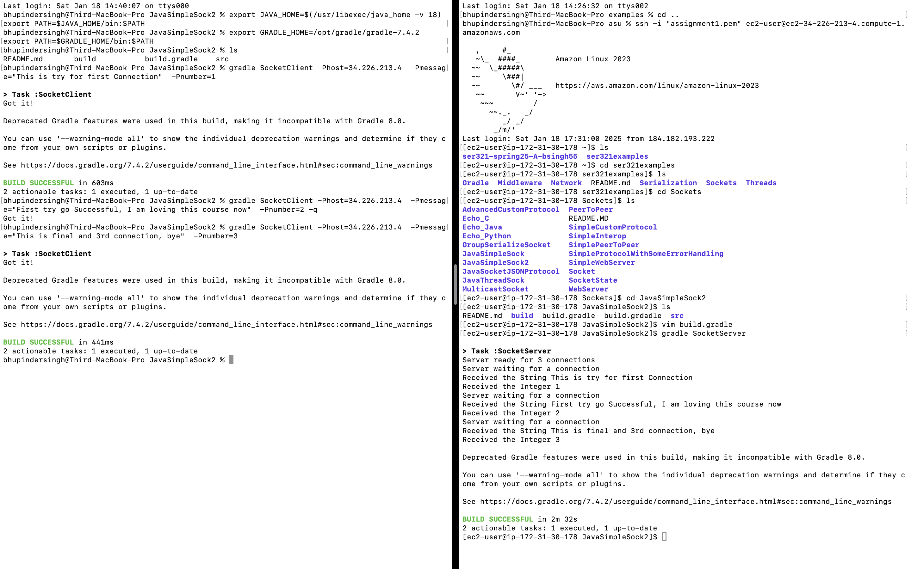
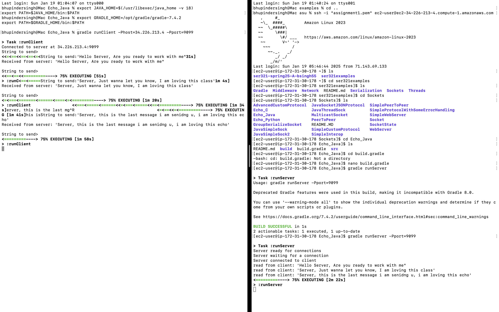
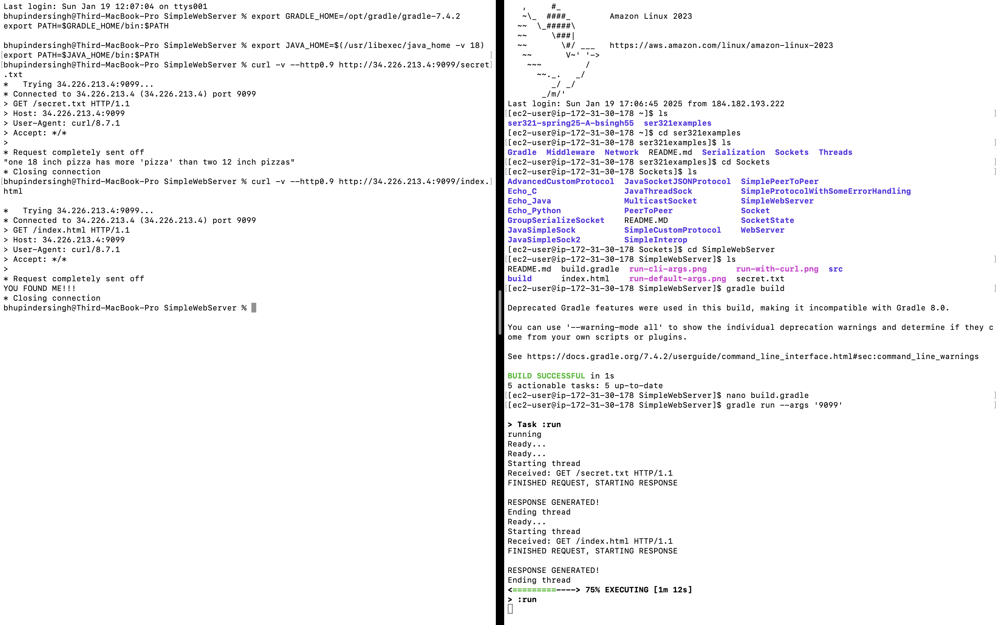
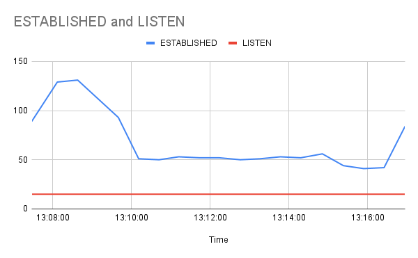
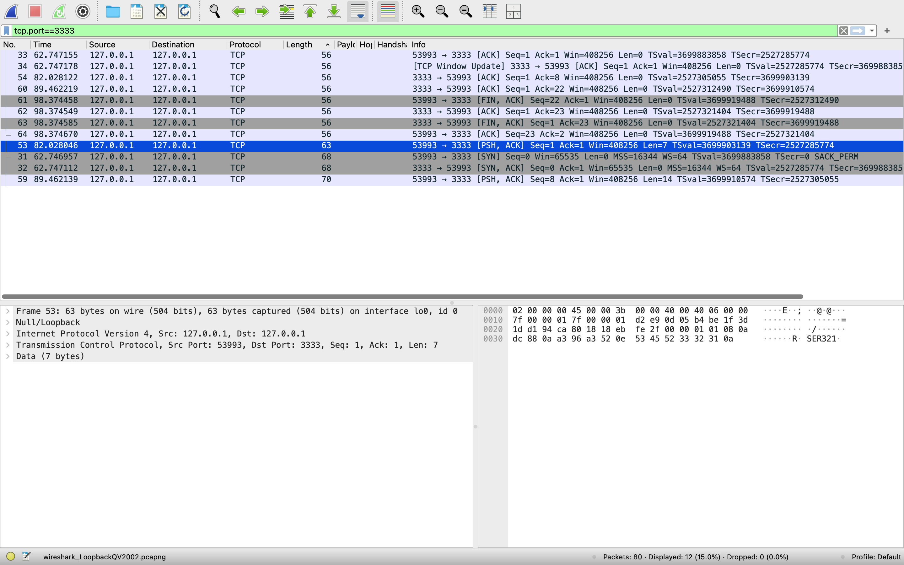
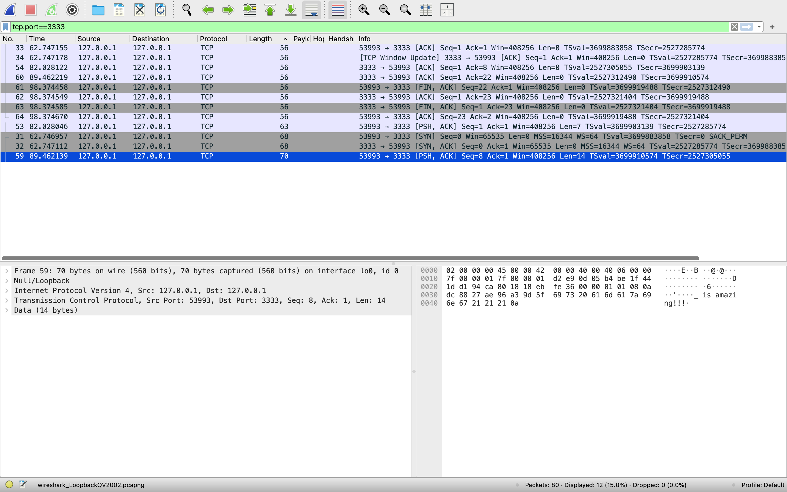
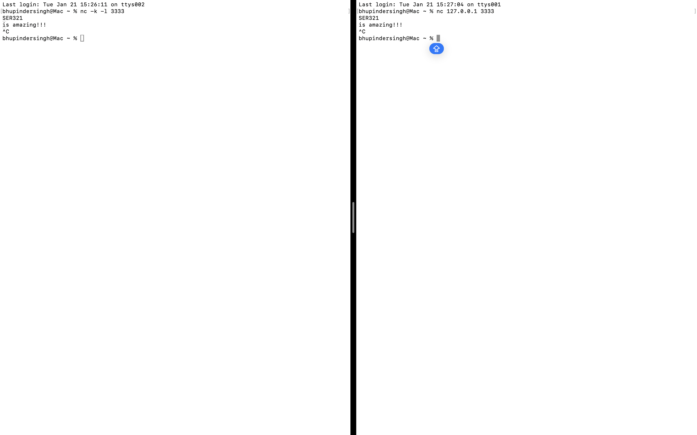
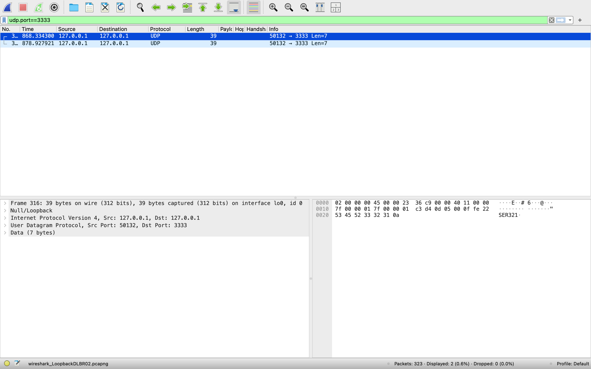
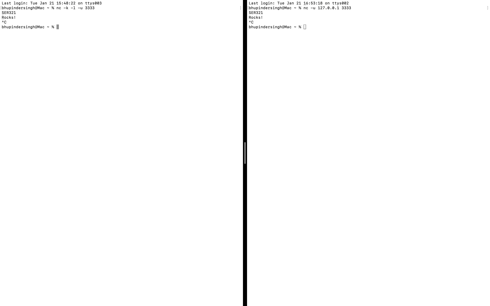

# GitHub Repository link :  

[ser321-spring25-A-bsingh55 - Assignment1 GitHub](https://github.com/singhbhupinder55/ser321-spring25-A-bsingh55/tree/master/Assignment1)

## Part 1 : Linux, Setup  
### Part 1.1 : Command line tasks  
#### System Used : Linux  

1: **mkdir cli_assignment** (This command creates a directory named cli_assignment.)  
2: **cd cli_assignment** (This command changes the current directory to the cli_assignment directory.)  
3: **touch stuff.txt** (This command creates an empty file named stuff.txt in the cli_assignment directory.)  
4: **cat > stuff.txt** (Adds multiple lines of text to the file. Press CTRL+D to stop adding text.)  
5: **wc -w stuff.txt and ww -l stuff. txt** (These commands count the number of words and lines in the file stuff.txt)  
6: **echo "additional test" >> stuff.txt** (This command appends more text to the stuff.txt file.)  
7: **mkdir draft** (This creates a new directory called draft.)  
8: **mv stuff.txt draft/** (Moves stuff.txt into the draft directory)  
9: **cd draft && touch .secret.txt** (Changes the current directory to draft and creates a hidden file called secret.txt)  
10: **cp -r draft final** (copies the draft directory to a new directory named final.)  
11: **mv draft draft.remove** (Renames the draft directory to draft.remove)  
12: **mv draft.remove final/** (Moves the draft.remove directory into the final directory.)  
13: **ls -l** (List all files and subdirectories along with their permissions in the cli_assgnment directory.)  
14: **zcat NASA_access_log_Aug95.gz** (Lists the contents of the NASA_access_log_Aug95.gz file without extracting it.)  
15: **guzip NASA_access_log_Aug95.gz** (Extracts the content of the NASA_access_log_Aug95.gz file)  
16: **mv NASA_access_log_Aug95.txt logs.txt** (Renames the extracted file to logs.txt)  
17: **mv logs.txt cli_assignment/** (Moves the logs.txt into the cli_assignment directory.)  
18: **head -n 100 logs.txt** (Reads the top 100 lines of the logs.txt)  
19: **head -n 100 logs.txt > logs_top_100.txt** (Creates a new file logs_top_100.txt containing the top 100 lines of logs.txt)  
20: **tail -n 100 logs.txt** (Reads the bottom 100 lines of the logs.txt file)  
21: **tail -n 100 logs.txt > logs_bottom_100.txt** (Creates annew file logs_bottom_100.txt containing the bottom 100 lines of logs.txt)  
22: **cat logs_top_100.txt logs_bottom_100.txt logs_snapshot.txt** (creates a new logs_snapshot.txt by concatenating logs_top_100.txt and logs_botton_100.txt)  
23: **echo "bsingh55: This is a great assignment, Jan 18th 2025" >> logs_snapshot.txt** (Appends your asurite and date to the logs_snapshot.txt file)  
24: **less logs.txt** (Reads the logs.txt file using the less command)  
25: **cut -d% -f1 marks.csv > student_names.txt** (Extracts the student names from the marks.csv file and saves them to student_names.txt)  
26: **cut -d% -f3 marks.csv | sort** (Extracts and sorts the marks from subject_3 in marks.csv)  
27: **awk -F% '{sum+=$2} END {print sum/NR}' marks.csv** (Calculates and prints the average marks from subject_2 in the marks.csv file.)  
28: **echo "average" > done.txt** (Saves the average marks from subject_2 into a new file done.txt)  
29: **mv done.txt final/** (Moves done.txt to the final directory)  
30: **mv final/done.txt final/average.txt** (Renames the file done.txt to average.txt in the final directory.)  


 
## 2.2 Running Examples
### Example 1: Running the Socket Server and Client  

I ran the example `JavaSimpleSock2` in the `Sockets` directory.  
The example demonstrates a TCP server-client communication where:  
- The server is set to accept up to 3 connections.  
- The client sends messages and numbers to the server.  

**Steps:**
1. The server (`SocketServer`) was started on AWS.  
2. The client (`SocketClient`) was run locally with the command:  
   `gradle SocketClient -PHost=34.226.213.4 -Pmessage="This is try for first connection" -Pnumber=1`.  
3. The server received and processed the messages sent by the client.  
4. I ran the client multiple times to simulate different messages and numbers.  

  
  
**Output Explanation:**
- The server successfully received connections and processed the messages.
- The client sent multiple messages as expected, and the server acknowledged each one.
- The final output shows the completion of all connections and messages processed.  
  


### Example 2: Running the Echo Client and Server  
#### Setup
In this example, we ran the Echo Client and Server program, which demonstrates a simple client-server communication using sockets. The server listens for incoming connections, and the client sends messages that the server echoes back.

### Steps
1. **Server** (`runServer` task):
   - The server was started on AWS, listening on port 9099.
   - Command to run the server:
     ```bash
     gradle runServer -Pport=9099
     ```
   - The server waits for incoming client connections, processes messages, and echoes them back.

2. **Client** (`runClient` task):
   - The client was run locally, connecting to the server using the `-Phost` and `-Pport` parameters. The client sends messages to the server.
   - Command to run the client:
     ```bash
     gradle runClient -Phost=34.226.213.4 -Pport=9099 -Pmessage="Hello, Server!"
     ```

### Result Screenshot
  

### Output
- The server waits for a connection from the client and then echoes back the messages it receives.
- Example messages sent by the client and received by the server:
  - **Client**: `Hello, Server!`
  - **Server**: `Hello, Server!`
  - **Client**: `Server, this is the last message I am sending u, i am loving this echo`
  - **Server**: `Server, this is the last message i am sending u, i am loving this echo`

The client successfully sent multiple messages, and the server echoed them back correctly.

 

### Example 3: SimpleWebServer

### Objective

In this example, we are running a simple web server which listens for incoming HTTP requests. It serves files such as `index.html` and `secret.txt` when requested by the client. The server works on both local and AWS environments and is accessible through the specified port (default 9099).

### Steps Taken

1. **Server Setup on AWS**:
   - The SimpleWebServer was deployed on an AWS EC2 instance, listening on port 9099.
   - It is designed to handle basic HTTP requests (HTTP/0.9 for compatibility with the client).

2. **Client Setup on Local Machine**:
   - We used the `curl` command on a local machine to test the functionality of the server.
   - We sent HTTP GET requests for the `index.html` and `secret.txt` files.
   
   **Command:**
   ```bash
   curl -v --http0.9 http://34.226.213.4:9099/index.html 
   ```
 **Server Response:**  
- The server processes the GET request and responds with the contents of the requested file (either index.html or secret.txt).  

 **ClientHandler:**   
-  handles the incoming requests and serves the requested files (either index.html or secret.txt).

3. **Testing and Results:**  
- The server responded correctly when accessed through the local machine using curl.
- The server also handled multiple requests for both index.html and secret.txt files, serving them as expected.
- In Screenshot below you can see the results from the curl command executed on the local machine:

### Result Screenshot


### Conclusion

In this example, we successfully set up a basic web server using Java. We implemented a simple HTTP server that accepts client requests, processes them in separate threads, and sends back the appropriate responses. The server is capable of handling requests for files like `index.html` and `secret.txt`. We also demonstrated how to interact with the server using `curl` from both local and remote environments, showcasing the ability to fetch files from the server. This example helped us understand the fundamentals of server-client communication, HTTP request handling, and threading in Java.

## 2.3. Understanding Gradle
- By clicking on the link below, you can access the JavaGradle folder in the repository, which contains the necessary files for this task.
[JavaGradle Folder](https://github.com/singhbhupinder55/ser321-spring25-A-bsingh55/tree/master/Assignment1/JavaGradle)


## Screencast link  for Part 2.4  

- [](https://www.youtube.com/watch?v=XSS4tpjUTwY)  
  


## 3.1.  TCP Network Socket Monitoring Report

### Objective
This task involves monitoring TCP network socket connections for a period of 10 minutes. The goal is to track the number of ESTABLISHED and LISTEN socket states over time using a bash script and visualize the data in a line chart.

## Methodology

### Data Collection
A custom bash script was used to monitor network connections and collect the number of ESTABLISHED and LISTEN socket connections every 30 seconds. The script runs in a loop, continuously appending the current time and socket states to a file (`tcp_connections.txt`). Below is the script used for data collection:

```bash
  #!/bin/bash

  # Output file
  OUTPUT_FILE="tcp_connections.txt"

  # Clear the contents of the output file at the start
  > "$OUTPUT_FILE"

  # Loop to monitor network connections every 30 seconds
  while true; do
  # Print the current date and time for clarity
  echo "Current Time: $(date)" >> "$OUTPUT_FILE"

  # Count the number of 'ESTABLISHED' connections
  ESTABLISHED_COUNT=$(netstat -a | grep ESTABLISHED | wc -l)
  echo "ESTABLISHED: $ESTABLISHED_COUNT" >> "$OUTPUT_FILE"

  # Count the number of 'LISTEN' connections
  LISTEN_COUNT=$(netstat -a | grep LISTEN | wc -l)
  echo "LISTEN: $LISTEN_COUNT" >> "$OUTPUT_FILE"
 
  # Wait for 30 seconds before checking again
  echo "------------------------------" >> "$OUTPUT_FILE"
 
done
```

This script counts the ESTABLISHED and LISTEN connections using the netstat command and appends the results to tcp_connections.txt.

### Graph Generation
The collected data from the tcp_connections.txt file was imported into Excel, and a line chart was generated to visualize the socket states over the 10-minute period. The graph below represents the number of ESTABLISHED and LISTEN socket connections at each 30-second interval.

## Graph of ESTABLISHED and LISTEN Socket States  
  

### Analysis
From the graph, we can observe the fluctuations in the number of ESTABLISHED connections, with spikes occurring at specific intervals. The number of LISTEN connections remained constant throughout the observation period.

### Conclusion
The monitoring task successfully tracked the TCP socket states, and the generated graph provides a clear visualization of network activity.


## Part 3.2 (Sniffing TCP/UDP Traffic) Step 1

### a) Explain both the commands you used in detail. What did they actually do?

- **Command 1: `nc -k -l 3333`**  
  This starts a TCP server that listens on port `3333`. The `-k` option allows the server to keep running and accepting multiple connections, and the `-l` option makes it listen for incoming connections.
  
- **Command 2: `nc 127.0.0.1 3333`**  
  This starts a TCP client that connects to the server at `127.0.0.1` (localhost) on port `3333`. Once connected, the client sends data (`SER321` and `is amazing!!!`) to the server.

### b) How many packets were sent back and forth so the client/server could send/receive these two lines?

At least **6 packets** were involved in sending the two lines (`SER321` and `is amazing!!!`):
  - 2 packets for the handshake (SYN, SYN-ACK).
  - 2 packets for data transfer (one for `SER321` and one for `is amazing!!!`).
  - 2 packets for connection termination (FIN, ACK).

### c) How many packets were needed back and forth to capture the whole "process" (starting the communication, ending the communication, sending the lines)?

**7 packets** in total:
  - 2 packets for the connection setup (SYN, SYN-ACK).
  - 2 packets for data transfer (one for each line sent).
  - 2 packets for connection teardown (FIN, ACK).
  - 1 additional packet to acknowledge the final data transfer.

### d) How many bytes is the data (only the data) that was sent from the client to the server?

- **`SER321`**: 7 bytes.
- **`is amazing!!!`**: 14 bytes.
- **Total data**: **7 + 14 = 21 bytes**.

### e) How many total bytes went over the wire (back and forth) for the whole process?

From the screenshots:
- **Packet 53** (Frame 53, data: `SER321`): 63 bytes (56 bytes header + 7 bytes data).
- **Packet 59** (Frame 59, data: `is amazing!!!`): 70 bytes (56 bytes header + 14 bytes data).
- Total bytes for data transfer = **63 + 70 = 133 bytes**.

### f) How much overhead was there? How many bytes was the whole process compared to the actual data sent?

- Total bytes sent (including headers): 63 bytes (Frame 53) + 70 bytes (Frame 59) = **133 bytes**.
- Total data sent: **21 bytes**.
- **Overhead**: **133 bytes - 21 bytes = 112 bytes**.  
  

## Screenshots

1. **Screenshot for `SER321`** (Frame 53), where you can see the packet containing the data "SER321".
  

2. **Screenshot for `is amazing!!!`** (Frame 59), where you can see the packet containing the data "is amazing!!!".
  

3. **Command-line screenshot** showing both the server and client commands being run and how the data is being typed into the client.
  

## Step 2 (UDP) Answers

### a) Explain both the commands you used in detail. What did they actually do?

- **`nc -k -l -u 3333`**:  
  This command starts a UDP server that listens on port `3333` for incoming messages. The `-k` option allows the server to stay open and continue listening for multiple connections. The `-l` option puts `nc` in listening mode (server mode), and `-u` specifies that UDP is used instead of TCP.

- **`nc -u 127.0.0.1 3333`**:  
  This command starts a UDP client that connects to the server at `127.0.0.1` (localhost) on port `3333`. The client sends the messages `SER321` and `Rocks!` to the server.

### b) How many packets were needed to capture those 2 lines?

- The two lines, `SER321` and `Rocks!`, required **2 UDP packets** for the data transfer. 
- One packet for `SER321` and another for `Rocks!`.

### c) How many packets were needed to capture the whole "process" (starting the communication, ending the communication)?

- **4 packets** were needed for the whole process:
  - 2 UDP packets for the data (`SER321` and `Rocks!`).
  - 2 additional packets for control (connection management), but UDP does not have handshakes or termination like TCP, so no additional control packets are necessary.

### d) How many bytes is the data (only the data) that was sent?

- **`SER321`**: 7 bytes.
- **`Rocks!`**: 6 bytes.
- **Total data sent**: **7 bytes + 6 bytes = 13 bytes**.

### e) How many total bytes went over the wire?

- From the Wireshark capture:
  - **Packet 316**: **39 bytes** (includes 7 bytes of data for `SER321` and 32 bytes of UDP header).
  - **Packet 317**: **39 bytes** (includes 7 bytes of data for `Rocks!` and 32 bytes of UDP header).
  - **Total bytes sent over the wire**: **39 bytes + 39 bytes = 78 bytes**.

### f) How many bytes was the whole process compared to the actual data that we sent?

- **Total bytes sent over the wire**: 78 bytes.
- **Actual data sent**: 13 bytes.
- **Overhead**: **78 bytes - 13 bytes = 65 bytes**.

### g) What is the difference in relative overhead between UDP and TCP and why?

- **UDP** has a small header (8 bytes) and no connection management (no SYN, ACK, or FIN packets). It sends data without establishing or tearing down a connection.
- **TCP** includes several extra overhead packets for connection setup (SYN), acknowledgment (ACK), and connection teardown (FIN), making its overhead significantly higher than UDP.
  - For example, a single TCP connection involves extra packets (SYN, ACK, FIN), which increases the total number of bytes sent over the wire.
  - UDP is simpler, with minimal overhead, while TCP ensures reliability, ordering, and connection control, but at the cost of additional packet size.

---

### **Screenshots to Include in the Markdown File:**

1. **Wireshark Capture for UDP** showing the data `SER321` and `Rocks!`:
   
   
   
2. **Command-line screenshot** showing both the server and client commands being run and how the data is being typed into the client.
   
