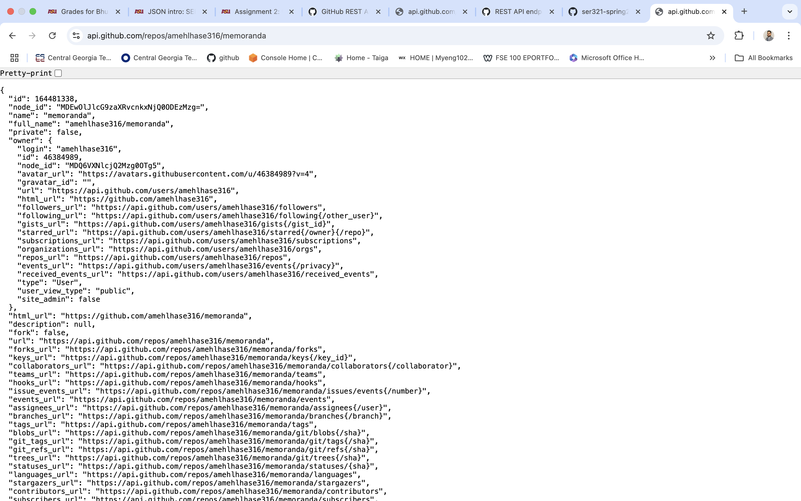

# Assignment 2 - Part 1: Understanding HTTP

## **API Calls Made**

### **API Call 1: List Repositories for a User**
- **URL**: `https://api.github.com/users/amehlhase316/repos`
- **Purpose**: Retrieves all public repositories owned by the user `amehlhase316`.
- **Information Provided**: The GitHub username (`amehlhase316`) is provided in the URL.
- **Example Output**: JSON containing repository details such as `id`, `name`, `full_name`, `description`, etc.
- **Screenshot**: 
- **Documentation**: [GitHub API - List repositories for a user](https://docs.github.com/en/rest/repos/repos#list-repositories-for-a-user)

---

### **API Call 2: Get a Specific Repository**
- **URL**: `https://api.github.com/repos/amehlhase316/memoranda`
- **Purpose**: Retrieves detailed information about the repository `memoranda` owned by the user `amehlhase316`.
- **Information Provided**: The username (`amehlhase316`) and repository name (`memoranda`) in the URL.
- **Example Output**: JSON containing repository details like `full_name`, `language`, `default_branch`, `forks_count`, `license`, and more.
- **Screenshot**: 
- **Documentation**: [GitHub API - Get a repository](https://docs.github.com/en/rest/repos/repos#get-a-repository)

---

### **API Call 3: List Commits on the Default Branch**
- **URL**: `https://api.github.com/repos/amehlhase316/memoranda/commits`
- **Purpose**: Retrieves all commits on the default branch (`master`) of the repository `memoranda`.
- **Information Provided**: The username (`amehlhase316`) and repository name (`memoranda`) in the URL.
- **Example Output**: JSON containing commit details such as `sha`, `author`, `message`, and `url`.
- **Screenshot**: 
- **Documentation**: [GitHub API - List commits](https://docs.github.com/en/rest/commits/commits#list-commits)

---

### **API Call 4: List Commits with Query Parameters**
- **URL**: `https://api.github.com/repos/amehlhase316/memoranda/commits?sha=master&per_page=40`
- **Purpose**: Retrieves commits on the `master` branch of the repository `memoranda`, with a limit of 40 commits per page.
- **Information Provided**:
  - `sha=master`: Specifies the branch (`master`).
  - `per_page=40`: Sets the maximum number of commits returned to 40.
- **Example Output**: Similar to the previous call but limited to 40 commits.
- **Screenshot**: 
- **Documentation**: [GitHub API - List commits](https://docs.github.com/en/rest/commits/commits#list-commits)

---

### **API Call 5: List Contributors**
- **URL**: `https://api.github.com/repos/amehlhase316/memoranda/contributors`
- **Purpose**: Retrieves all contributors to the `memoranda` repository along with their contribution count.
- **Information Provided**: The username (`amehlhase316`) and repository name (`memoranda`) in the URL.
- **Example Output**: JSON containing contributor details like `login`, `id`, `avatar_url`, and `contributions`.
- **Screenshot**: 
- **Documentation**: [GitHub API - List contributors](https://docs.github.com/en/rest/repos/repos#list-repository-contributors)

---

### **Consolidated List of URLs**
- `https://api.github.com/users/amehlhase316/repos`
- `https://api.github.com/repos/amehlhase316/memoranda`
- `https://api.github.com/repos/amehlhase316/memoranda/commits`
- `https://api.github.com/repos/amehlhase316/memoranda/commits?sha=master&per_page=40`
- `https://api.github.com/repos/amehlhase316/memoranda/contributors`

---

## **Stateless vs. Stateful Communication**

### **Stateless Communication**
- In stateless communication, each request from the client to the server is independent and contains all the information necessary to understand and process the request.
- **Example**: The GitHub REST API is stateless:
  - Each API call (e.g., listing repositories, fetching commits) is a separate, independent transaction.
  - The server does not retain any memory of previous requests made by the client.

### **Stateful Communication**
- In stateful communication, the server maintains the context of the client's session across multiple requests. The server remembers information such as authentication, session data, or the progress of an interaction.
- **Example**: A user login session on a website:
  - The server tracks the user's session ID after login and ties it to subsequent actions (e.g., viewing a profile, making purchases).

### **Why is the GitHub API Stateless?**
- It simplifies scaling and load balancing by not requiring servers to maintain session information.
- Each request includes all necessary details (e.g., API tokens, query parameters) for the server to process it independently.

---
