# Assignment 2 - Part 1: Understanding HTTP

## **API Calls Made**

### **API Call 1: List Repositories for a User**
- **URL**: `https://api.github.com/users/amehlhase316/repos`
- **Purpose**: Retrieves all public repositories owned by the user `amehlhase316`.
- **Information Provided**: The GitHub username (`amehlhase316`) is provided in the URL.
- **Example Output**: JSON containing repository details such as `id`, `name`, `full_name`, `description`, etc.
- **Screenshot**: 
- **Documentation**: [GitHub API - List repositories for a user](https://docs.github.com/en/rest/repos/repos#list-repositories-for-a-user)

---

### **API Call 2: Get a Specific Repository**
- **URL**: `https://api.github.com/repos/amehlhase316/memoranda`
- **Purpose**: Retrieves detailed information about the repository `memoranda` owned by the user `amehlhase316`.
- **Information Provided**: The username (`amehlhase316`) and repository name (`memoranda`) in the URL.
- **Example Output**: JSON containing repository details like `full_name`, `language`, `default_branch`, `forks_count`, `license`, and more.
- **Screenshot**: 
- **Documentation**: [GitHub API - Get a repository](https://docs.github.com/en/rest/repos/repos#get-a-repository)

---

### **API Call 3: List Commits on the Default Branch**
- **URL**: `https://api.github.com/repos/amehlhase316/memoranda/commits`
- **Purpose**: Retrieves all commits on the default branch (`master`) of the repository `memoranda`.
- **Information Provided**: The username (`amehlhase316`) and repository name (`memoranda`) in the URL.
- **Example Output**: JSON containing commit details such as `sha`, `author`, `message`, and `url`.
- **Screenshot**: 
- **Documentation**: [GitHub API - List commits](https://docs.github.com/en/rest/commits/commits#list-commits)

---

### **API Call 4: List Commits with Query Parameters**
- **URL**: `https://api.github.com/repos/amehlhase316/memoranda/commits?sha=master&per_page=40`
- **Purpose**: Retrieves commits on the `master` branch of the repository `memoranda`, with a limit of 40 commits per page.
- **Information Provided**:
  - `sha=master`: Specifies the branch (`master`).
  - `per_page=40`: Sets the maximum number of commits returned to 40.
- **Example Output**: Similar to the previous call but limited to 40 commits.
- **Screenshot**: 
- **Documentation**: [GitHub API - List commits](https://docs.github.com/en/rest/commits/commits#list-commits)

---

### **API Call 5: List Contributors**
- **URL**: `https://api.github.com/repos/amehlhase316/memoranda/contributors`
- **Purpose**: Retrieves all contributors to the `memoranda` repository along with their contribution count.
- **Information Provided**: The username (`amehlhase316`) and repository name (`memoranda`) in the URL.
- **Example Output**: JSON containing contributor details like `login`, `id`, `avatar_url`, and `contributions`.
- **Screenshot**: 
- **Documentation**: [GitHub API - List contributors](https://docs.github.com/en/rest/repos/repos#list-repository-contributors)

---

### **Consolidated List of URLs**
- `https://api.github.com/users/amehlhase316/repos`
- `https://api.github.com/repos/amehlhase316/memoranda`
- `https://api.github.com/repos/amehlhase316/memoranda/commits`
- `https://api.github.com/repos/amehlhase316/memoranda/commits?sha=master&per_page=40`
- `https://api.github.com/repos/amehlhase316/memoranda/contributors`

---


## **Stateless vs. Stateful Communication**

### **Stateless Communication**
- In stateless communication, each request from the client to the server is independent and contains all the information necessary to understand and process the request.
- **Example**: The GitHub REST API is stateless:
  - Each API call (e.g., listing repositories, fetching commits) is a separate, independent transaction.
  - The server does not retain any memory of previous requests made by the client.

### **Stateful Communication**
- In stateful communication, the server maintains the context of the client's session across multiple requests. The server remembers information such as authentication, session data, or the progress of an interaction.
- **Example**: A user login session on a website:
  - The server tracks the user's session ID after login and ties it to subsequent actions (e.g., viewing a profile, making purchases).

### **Why is the GitHub API Stateless?**
- It simplifies scaling and load balancing by not requiring servers to maintain session information.
- Each request includes all necessary details (e.g., API tokens, query parameters) for the server to process it independently.

---

# Task 2

## Part 2.2: Running a Simple Java WebServer

## **Setting Up the WebServer**

- **Server Public IP**: `34.226.213.4`
- **Port**: `9000`

The WebServer was successfully launched on the second machine (AWS) and made accessible using the public IP address and port `9000`. Below are the results of testing different GET requests.

---

### **GET Requests and Outputs**

#### **1. Main Page**
- **URL**: `http://34.226.213.4:9000`
- **Purpose**: Displays the available GET requests and file structure within the server.
- **Screenshot**: 

#### **2. Random Page**
- **URL**: `http://34.226.213.4:9000/random`
- **Purpose**: Serves the `index.html` file with the bread image.
- **Screenshot**: 

#### **3. JSON Response**
- **URL**: `http://34.226.213.4:9000/json`
- **Purpose**: Returns a JSON object derived from the `/random` request.
- **Output**:
  ```json
  {
    "header": "streets",
    "image": "https://iili.io/JVlpSV.jpg"
  }
  ```
- **Screenshot**: 

#### **4. Index File**
- **URL**: `http://34.226.213.4:9000/file/www/index.html`
- **Purpose**: Displays the `index.html` file content.
- **Screenshot**: 

#### **5. Root File**
- **URL**: `http://34.226.213.4:9000/file/www/root.html`
- **Purpose**: Displays the `root.html` file content.
- **Screenshot**: 

---

### **AWS Server Console Output**

#### **1. Server Running Logs**
- The AWS console confirms the server is running and processing requests as expected.
- **Screenshot**:
  - 
  - 

---

## **Conclusion**
- The WebServer successfully processed all requests, and outputs were as expected.
- Screenshots for the web browser and server console validate the successful completion of Task 2.2.

---

## 2.3 Analyze What Happens

### Wireshark Screenshot
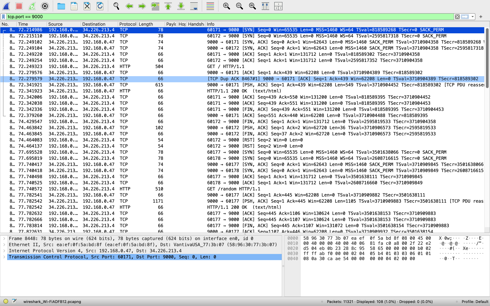

### 1. What filter did you use? Explain why you chose that filter.
**Filter used:** `tcp.port == 9000`  
**Explanation:** This filter ensures that only the traffic going to and from the web server on port 9000 is captured, as the web server is configured to listen on this port for HTTP requests.

### 2. What happens when you are on the `/random` page and click the "Random" button? Compare this to refreshing your browser.
- **Clicking the "Random" button:** When you click the "Random" button, the server processes the `/random` endpoint again, and the image displayed alternates between "bread" and "streets."  
- **Refreshing the browser on `/random`:** Similarly, Refreshing causes the server to reprocess the `/random` endpoint, resulting in the display of random content. For example:
  - The first refresh showed "bread."
  - The second refresh showed "streets."

### 3. What types of response codes are you able to receive through different requests to your server?

1. **200 (OK):**  
   This response is returned for valid requests where the server successfully processes and responds. For example:
   - Accessing `/random`, `/json`,etc., returns a 200 status because these are valid endpoints.

2. **400 (Bad Request):**  
   This response occurs if a request is malformed or missing required parameters. For example:
   - If a GET request to `/multiply` or `/github` is made without the expected query parameters, the server should return a 400 status.

3. **404 (Not Found):**  
   This response is returned when the requested resource or endpoint does not exist. For example:
   - Accessing a URL like `/nonexistent` or a misspelled endpoint will return a 404 status because the server cannot find the requested resource.

### 4. Explain the response codes you receive and why you get them.
- **200 OK:** This response is received when a valid request is processed successfully by the server (e.g., accessing `/random` or `/json`).  
- **400 Bad Request:** This occurs when the request is malformed or contains invalid parameters.  
- **404 Not Found:** This is returned when a request is made to a non-existent resource or endpoint (e.g., a typo in the URL).

### 5. When you do a `<publicIP>:9000`, take a look at what Wireshark generates as a server response. Are you able to find the data that the server sends back to you?
**Observation:** Yes, the "Data" section of the server response in Wireshark contains the HTML content sent by the server. This plain text data corresponds to what is displayed in the browser.

### 6. Based on the previous question, explain why HTTPS is now more common than HTTP.
**Explanation:** HTTPS is more secure as it encrypts the data transmitted between the client and the server, ensuring privacy and preventing interception by unauthorized parties. HTTP, on the other hand, transmits data in plain text, which makes it vulnerable to eavesdropping and attacks.

### 7. In our case - what port does the server listen to for HTTP requests, and is that the most common port for HTTP?
**Port used:** 9000.  
**Explanation:** While port 9000 is used for this specific setup, the most common port for HTTP traffic is port 80.

### 8. Which local port is used when sending different requests to the WebServer?
**Observation:** Local ports are dynamically allocated by the operating system. For example, during the test, ports like 60171, 60172, 60177, 60178 and 60180  were observed in the captured packets.

## 2.4 Setting up a "real" WebServer

#### Deliverables:

1. **What is the URL that you can now use to reach the main page?**
   - The URL to access the main page is: `http://34.226.213.4`

2. **Check the traffic to your WebServer. What port is the traffic going to now? Is it the same as before, or is it (and should it) be different?**
   - The traffic is now going to **port 80**. This is different from before, as the original traffic was routed to **port 9000**. This change is expected because NGINX is configured to listen on port 80 and forward the requests to the Java server on port 9000.

3. **Is it still using HTTP, or is it now using HTTPS? Why?**
   - The traffic is still using **HTTP**. This is because the NGINX configuration is currently set up for HTTP only, and HTTPS requires additional steps such as setting up SSL certificates, which have not been done yet.

4. **Could you change your security settings on AWS now?**
   - Yes, the security settings on AWS can now be updated to **remove port 9000** from being open, as NGINX is acting as a reverse proxy and handles all traffic through port 80.

5. **Take a screenshot of your web browser, your second machine, and the port number on Wireshark.**
#### Screenshot of Wireshark for traffic on port 80:


#### Screenshot of Web Browser showing the main page:


---
## 2.5 Setting up HTTPS

### Deliverable 1: What port is your traffic going through now?
The traffic is now going through **port 443**, as observed in the Wireshark capture. This is the default port for HTTPS traffic.

### Deliverable 2: Can you still find the plain text responses that were found with HTTP?
No, the plain text responses are no longer visible. All traffic is now encrypted due to the implementation of HTTPS, as confirmed by the secure connection shown in the browser and the encrypted packets in Wireshark.

### Screenshots:
1. **Web Browser Screenshot with HTTPS**  
   

2. **Web Browser Screenshot for Random Endpoint with Secure Connection**  
   

3. **Terminal Screenshot with Certbot Setup and FunWebServer Logs**  
   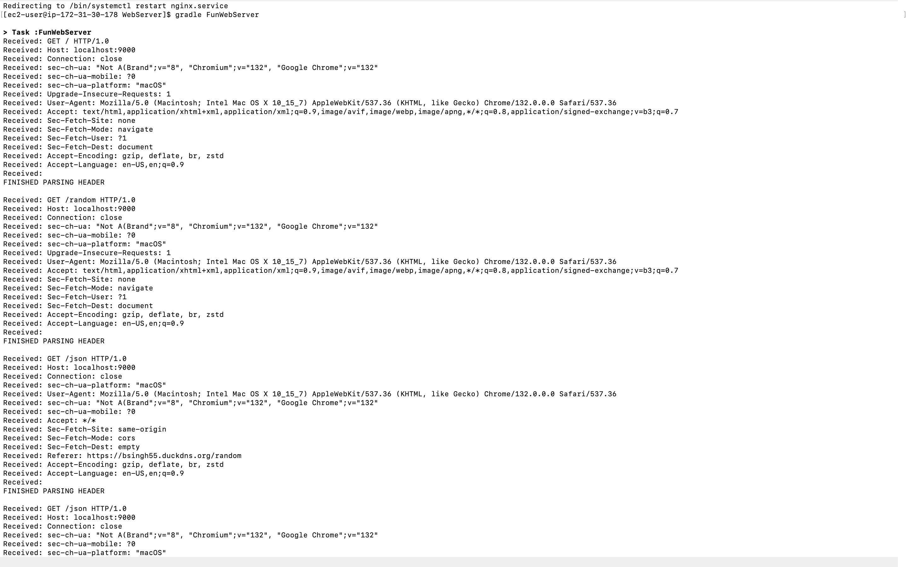

4. **Wireshark Screenshot Showing HTTPS Traffic on Port 443**  
   

### Notes:
- The browser screenshots confirm the secure connection to `https://bsingh55.duckdns.org`.
- The FunWebServer logs show successful communication with HTTPS.
- Wireshark confirms encrypted communication over port 443.

Everything has been configured as per the assignment requirements, and HTTPS is successfully enabled.

## 2.6.1 Multiply

## Implementation Explanation
The `/multiply` endpoint was implemented to handle two parameters: `num1` and `num2`. Error handling was added to ensure that invalid or missing parameters do not crash the server and that the responses are meaningful and appropriate. The following changes were made:

1. **Error Handling for Missing Parameters**:
   - If either `num1` or `num2` is missing from the query string, the server responds with:
     - **HTTP 400 Bad Request**
     - A message: `"Missing parameters: num1 and num2 are required."`
   - This was implemented to handle incomplete requests where one or both parameters are not provided.

2. **Error Handling for Non-Integer Inputs**:
   - If the values of `num1` or `num2` are not integers, the server responds with:
     - **HTTP 406 Not Acceptable**
     - A message: `"Invalid input: num1 and num2 must be integers."`
   - This ensures that the server can handle unexpected data types gracefully.

3. **Successful Requests**:
   - When valid integers are provided for `num1` and `num2`, the server performs the multiplication and responds with:
     - **HTTP 200 OK**
     - The result of the multiplication in the body: `"Result is: <value>"`

---

## HTTP Status Codes Used
1. **HTTP 200 OK**:
   - Used for valid requests where both `num1` and `num2` are provided as integers.
   - Indicates that the operation was successful.

2. **HTTP 400 Bad Request**:
   - Used when either or both parameters (`num1`, `num2`) are missing.
   - Chosen because the request cannot be processed without the required parameters.

3. **HTTP 406 Not Acceptable**:
   - Used when `num1` or `num2` is not a valid integer.
   - Chosen to indicate that the server cannot process the input due to an unacceptable format.

---

## Example URLs for Testing

### Valid Request:
```text
http://localhost:9000/multiply?num1=5&num2=7
```
- **Response:** "Result is: 35"
- **HTTP Status:** 200 OK

### Missing Parameters:
```
http://localhost:9000/multiply?num1=5
```
- **Response:** "Missing parameters: num1 and num2 are required."
- **HTTP Status:** 400 Bad Request

### Invalid Input (Non-Integer):
```
http://localhost:9000/multiply?num1=5.5&num2=7
```
- **Response:** "Invalid input: num1 and num2 must be integers."
- **HTTP Status:** 406 Not Acceptable

---


## Assignment 2.6.2: GitHub API Integration with WebServer

### Task Description:
This task required us to implement a web server that integrates with the GitHub API. Upon querying the endpoint with the path `github?query=<resource>`, the server fetches the requested resource from GitHub and displays the repository details. The server must also provide robust error handling to ensure it does not crash with invalid inputs.

---

### Implementation Details:

1. **Valid Endpoint:**
   - **URL:** `http://localhost:9000/github?query=users/amehlhase316/repos`
   - **Expected Output:** 
     - A list of repositories showing:
       - Full Name
       - ID
       - Owner's Login
   - **Screenshot:**  
     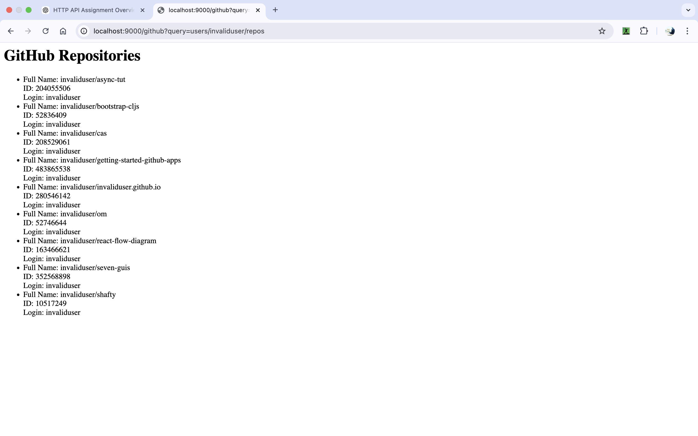  
     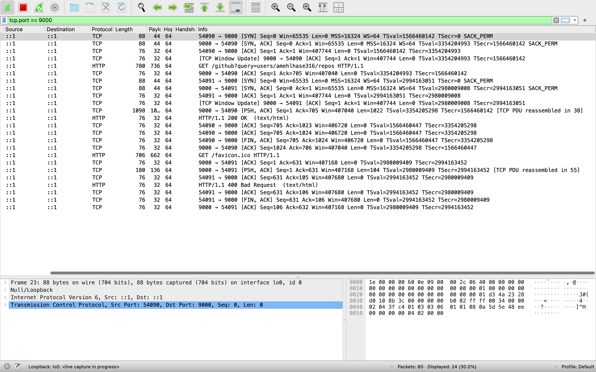

2. **Invalid Endpoint (Nonexistent User):**
   - **URL:** `http://localhost:9000/github?query=users/bs123141/repos`
   - **Expected Output:**  
     - Message: `GitHub user or resource not found.`
     - HTTP Code: 404 Not Found
   - **Screenshot:**  
     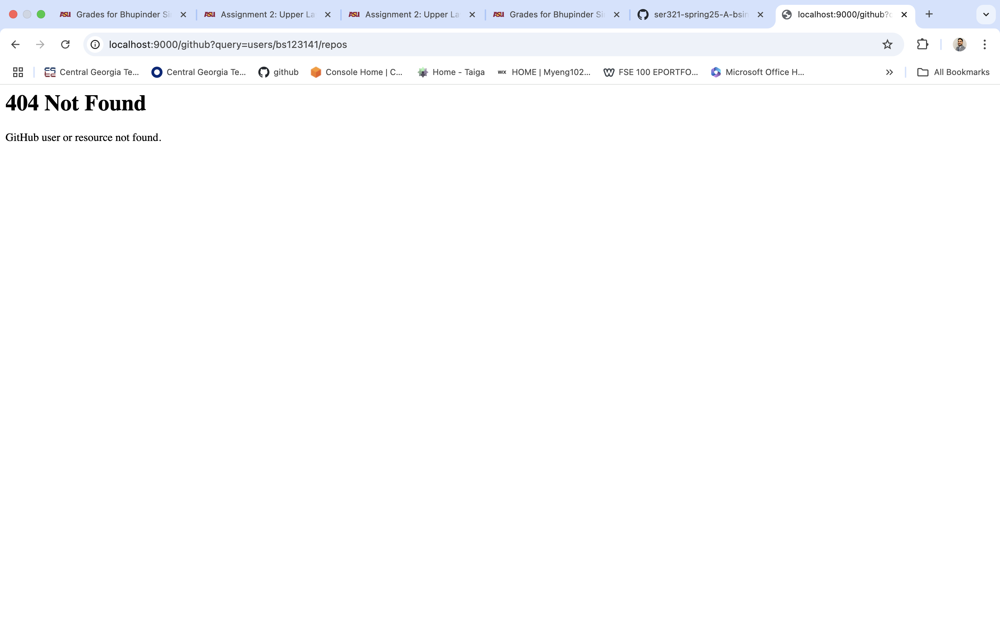  
     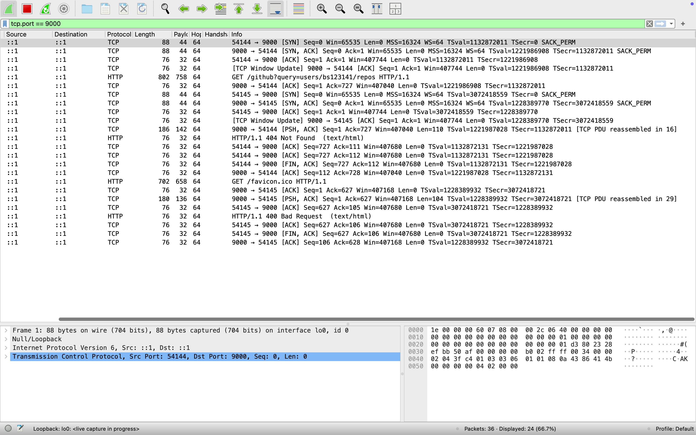

3. **Invalid Query:**
   - **URL:** `http://localhost:9000/github`
   - **Expected Output:**  
     - Message: `Missing 'query' parameter.`
     - HTTP Code: 400 Bad Request
   - **Screenshot:**  
     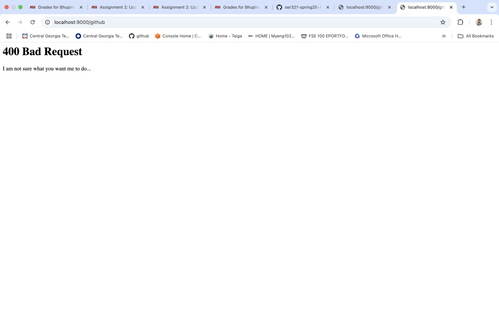  
     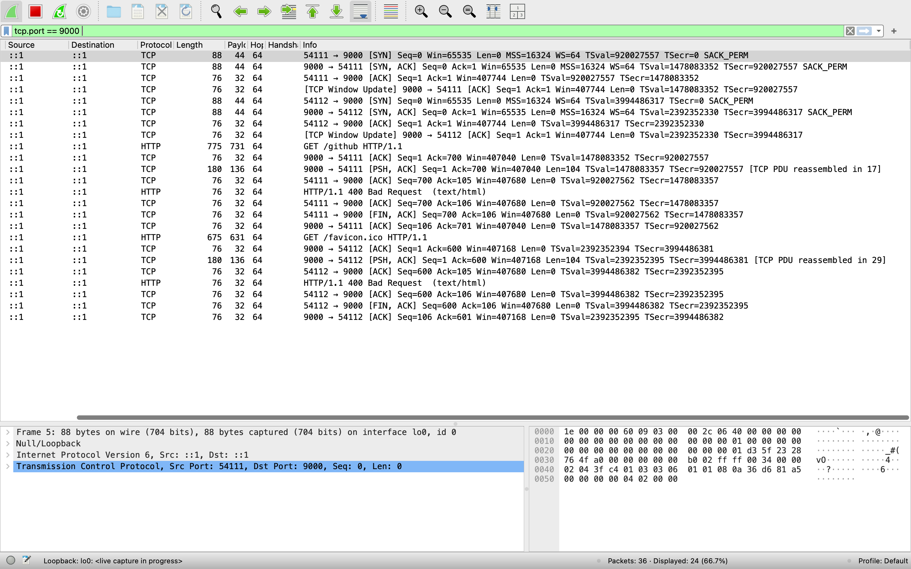

---

### Error Handling:
The following error codes were implemented:
1. **400 Bad Request:** Returned when the query parameter is missing or malformed.
2. **404 Not Found:** Returned when the requested GitHub user or resource does not exist.
3. **500 Internal Server Error:** Triggered by runtime issues such as parsing errors or timeouts when interacting with the GitHub API.

---

### Conclusion:
The web server is designed to handle a wide range of inputs robustly, ensuring it does not crash under unexpected or invalid requests. All requested error codes were tested and are functioning as intended.


## 2.6.3 Make Your Own Requests

### Implemented Request Types

#### 1. Distance Calculation
**Endpoint**: `/distance`  
**Description**: Calculates the Euclidean distance between two points `(x1, y1)` and `(x2, y2)`.  
**Parameters**:
- `x1` (numeric, required)
- `y1` (numeric, required)
- `x2` (numeric, required)
- `y2` (numeric, required)

**Test Cases**:
1. **Valid Input**  
   - **URL**: `http://localhost:9000/distance?x1=0&y1=0&x2=3&y2=4`  
   - **Expected Output**:  
     - **Browser**: `200 OK`, Distance: `5.0`  
     - **Wireshark**: Confirmed `200 OK` with payload.
   - **Screenshot**:  
     - 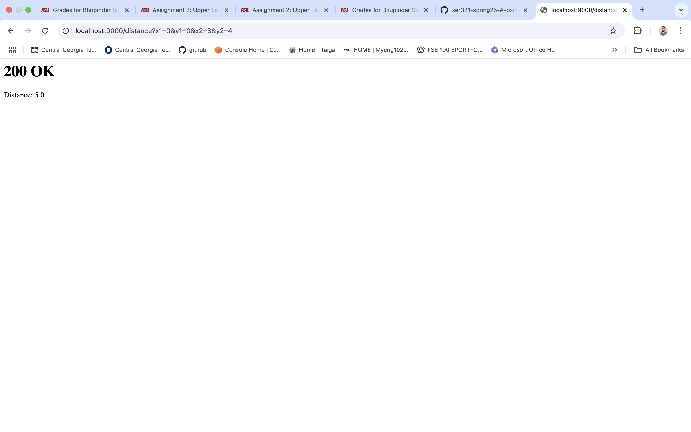  
     - 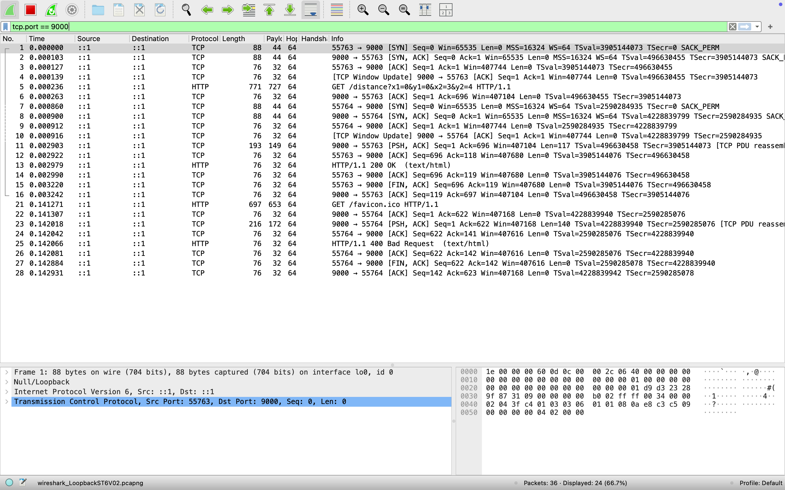

2. **Missing Parameters**  
   - **URL**: `http://localhost:9000/distance?x1=0&y1=0`  
   - **Expected Output**:  
     - **Browser**: `400 Bad Request`, Error: `Missing parameters: x1, y1, x2, and y2 are required.`  
     - **Wireshark**: Confirmed `400 Bad Request`.
   - **Screenshot**:  
     - 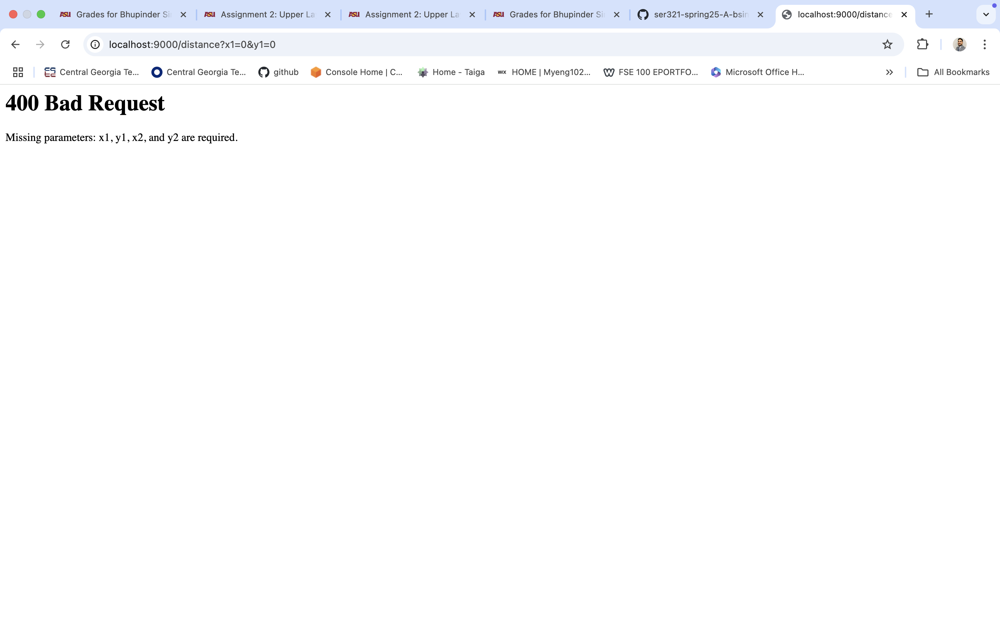  
     - 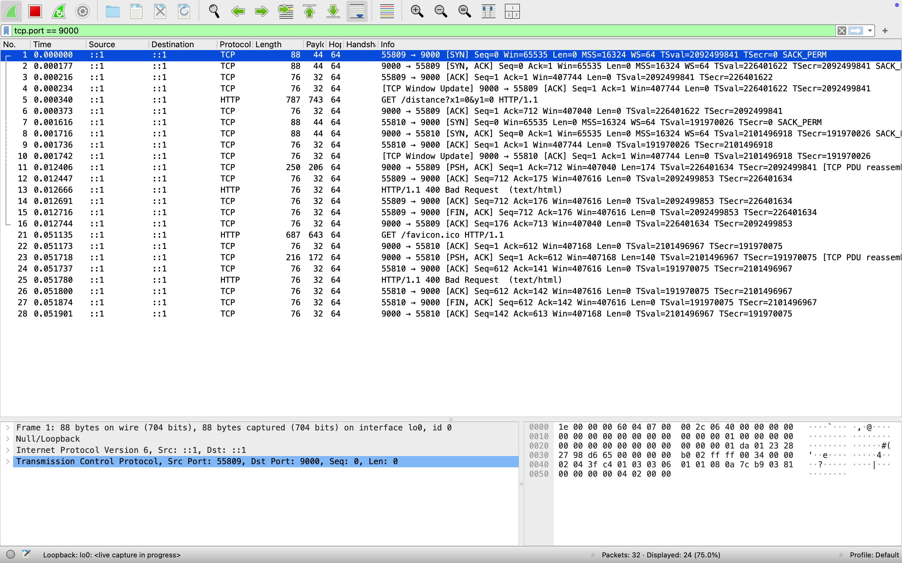

3. **Invalid Parameters**  
   - **URL**: `http://localhost:9000/distance?x1=abc&y1=0&x2=3&y2=4`  
   - **Expected Output**:  
     - **Browser**: `406 Not Acceptable`, Error: `Invalid input: x1, y1, x2, and y2 must be numeric.`  
     - **Wireshark**: Confirmed `406 Not Acceptable`.
   - **Screenshot**:  
     - 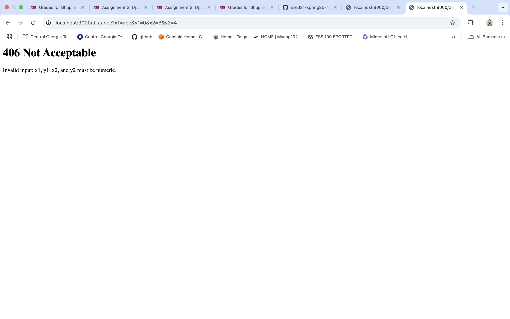  
     - 

---

#### 2. Temperature Conversion
**Endpoint**: `/convertTemp`  
**Description**: Converts a temperature from Celsius to Fahrenheit.  
**Parameters**:
- `celsius` (numeric, required)

**Test Cases**:
1. **Valid Input**  
   - **URL**: `http://localhost:9000/convertTemp?celsius=100`  
   - **Expected Output**:  
     - **Browser**: `200 OK`, Output: `100.0°C = 212.0°F`  
     - **Wireshark**: Confirmed `200 OK` with payload.
   - **Screenshot**:  
     -   
     - 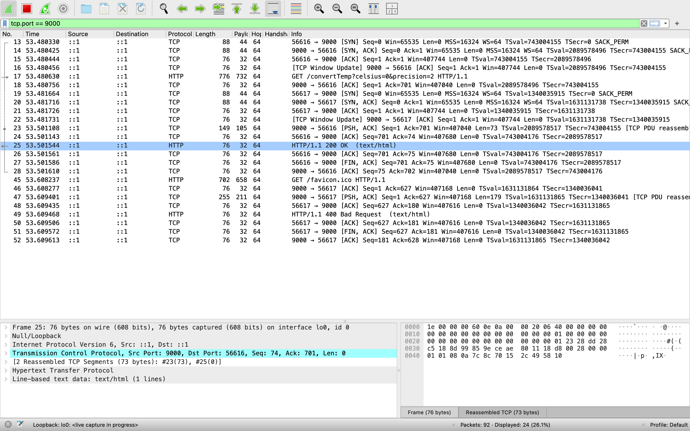

2. **Missing Parameter**  
   - **URL**: `http://localhost:9000/convertTemp`  
   - **Expected Output**:  
     - **Browser**: `400 Bad Request`, Error: `I am not sure what you want me to do...`  
     - **Wireshark**: Confirmed `400 Bad Request`.
   - **Screenshot**:  
     - 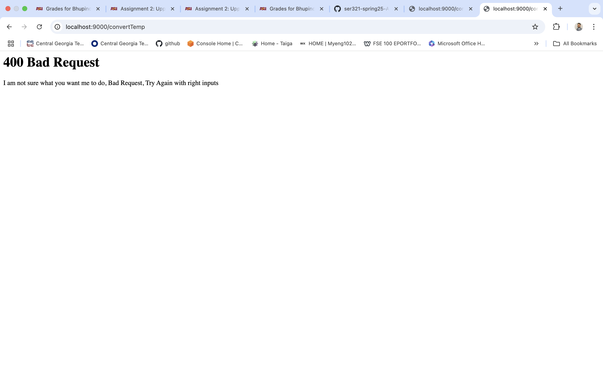  
     - 

3. **Invalid Parameter**  
   - **URL**: `http://localhost:9000/convertTemp?celsius=abc`  
   - **Expected Output**:  
     - **Browser**: `406 Not Acceptable`, Error: `Invalid input: celsius must be a valid number.`  
     - **Wireshark**: Confirmed `406 Not Acceptable`.
   - **Screenshot**:  
     - 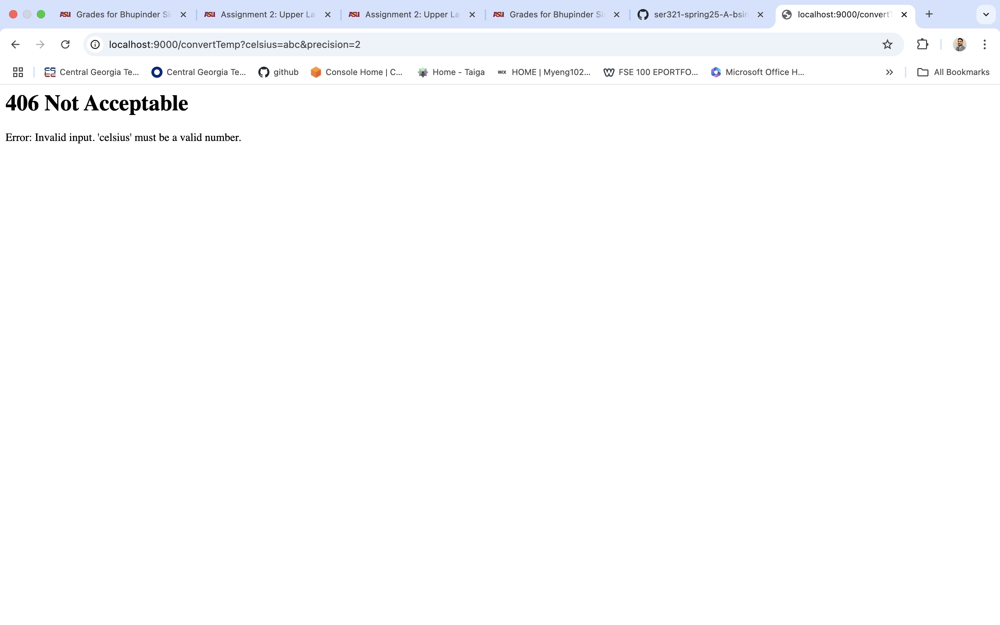  
     - 

---

### Summary of Work Completed
1. Added two new request types:
   - **Distance Calculation**: Handles numeric inputs to compute the Euclidean distance.
   - **Temperature Conversion**: Converts Celsius to Fahrenheit with appropriate error handling.
2. Implemented:
   - **Error Handling**: Provided detailed error codes (`400` and `406`) with user-friendly error messages.
   - **Validation**: Checked for missing and invalid parameters.
3. Verified functionality through extensive testing:
   - Valid inputs.
   - Edge cases for missing and invalid inputs.
   - Captured HTTP traffic using Wireshark to validate the server's response codes and payloads.
4. Provided screenshots for all test cases to demonstrate the correctness of the implementation.

### Files Included
- **Browser Output**:  
  - Distance: `screenshots2/dvalid2.6.3.png`, `screenshots2/dbad400.png`, `screenshots2/d406.png`.  
  - Temperature: `screenshots2/tvalid.png`, `screenshots2/t400.png`, `screenshots2/t406.png`.  
- **Wireshark Traces**:  
  - Distance: `screenshots2/dwireshark2.6.3.png`, `screenshots2/dwireshark400.png`, `screenshots2/dwireshark406.png`.  
  - Temperature: `screenshots2/twireshark200.png`, `screenshots2/twireshark400.png`, `screenshots2/twireshark406.png`.
